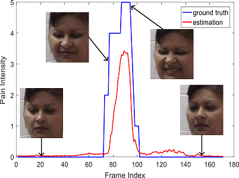

# PainRegression

Transferring Face Verification Nets To Pain and Expression Regression

https://arxiv.org/abs/1702.06925



#Requirements

1. My Caffe (https://github.com/happynear/caffe-windows/tree/ms). If you don't want to train with class-balance sampling ([image_data_layer.cpp](https://github.com/happynear/caffe-windows/blob/ms/src/caffe/layers/image_data_layer.cpp)) and observing Pearson Correlation during training ([correlation_loss_layer.cpp](https://github.com/happynear/caffe-windows/blob/ms/src/caffe/layers/correlation_loss_layer.cpp)), you may use the official Caffe.
2. Matlab,
3. GPU with CUDA support,
4. MTCNN face and facial landmark detector(https://github.com/kpzhang93/MTCNN_face_detection_alignment).

#Regression Results and Evaluation

We uploaded some of the predicted values generated by our algorithm in `/results`. You may load them in Matlab and run [scripts/get_accuracy.m](https://github.com/happynear/PainRegression/blob/master/scripts/get_accuracy.m) to get the performance under various metrics.

#Training

1. Download the UNBC-McMaster Shoulder Pain Dataset(http://www.consortium.ri.cmu.edu/painagree/). 

2. Download the pre-trained face verification model from [Google Drive](https://drive.google.com/file/d/0B0OhXbSTAU1HUTVhNE1sX1o2STQ/view?usp=sharing) or [Baidu Yun](http://pan.baidu.com/s/1pKOmZZt).

3. Detect and align the faces in the dataset by [./scripts/general_align.m](https://github.com/happynear/PainRegression/blob/master/scripts/general_align.m).

4. Create list for Caffe's ImageData layer by [./scripts/create_list.m](https://github.com/happynear/PainRegression/blob/master/scripts/create_list.m) and [./scripts/create_sublist.m](https://github.com/happynear/PainRegression/blob/master/scripts/create_sublist.m)(For cross-validation).

5. Copy all the folders created by [./scripts/create_sublist.m](https://github.com/happynear/PainRegression/blob/master/scripts/create_sublist.m) to `./prototxt/` and run [./prototxt/run_script.cmd](https://github.com/happynear/PainRegression/blob/master/prototxt/run_script.cmd).

It takes about 4-6 hours to train all 25-fold cross validation.

#Validation

1. Use [./scripts/extract_feature.m](https://github.com/happynear/PainRegression/blob/master/scripts/extract_feature.m) to extract results from the 25-fold cross-validation.

2. Get the performance by [./scripts/get_accuracy.m](https://github.com/happynear/PainRegression/blob/master/scripts/get_accuracy.m).

We suggest and encourage further works to use the new proposed evaluation metrics, **wMAE** and **wMSE**. The evaluation codes are in [./scripts/get_accuracy.m](https://github.com/happynear/PainRegression/blob/master/scripts/get_accuracy.m).

#License

This code is distributed under MIT LICENSE

Citation

```
@article{Wang2017Pain,
Author = {Feng Wang and Xiang Xiang and Chang Liu and Trac D. Tran and Austin Reiter and Gregory D. Hager and Harry Quon and Jian Cheng and Alan L. Yuille},
Title = {Transferring Face Verification Nets To Pain and Expression Regression},
Year = {2017},
Eprint = {arXiv:1702.06925},
Doi = {10.13140/RG.2.2.20841.49765},
}
```

#Contact

Feng Wang [feng.wff(at)gmail.com] or Xiang Xiang [xxiang(at)cs.jhu.edu]

(please replace (at) with @.)
